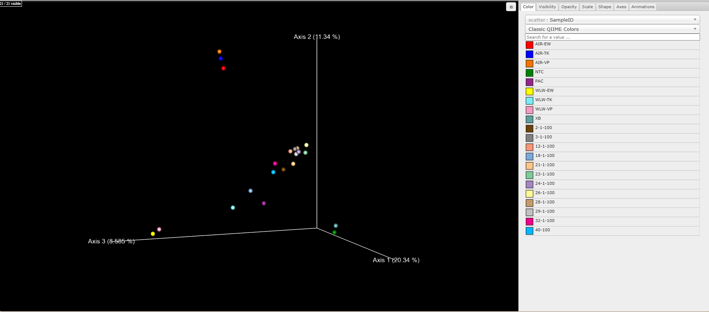

# Aerosol Exposure of Cyanotoxins from Cyanobacteria Increases the Risk for Developing Neurodegenerative Diseases 

## Author 
Hannah Muskavitch 

## Introduction 

The pathologies of neurodegenerative diseases, such as Alzheimer's disease (AD), Parkinson’s disease (PD), and amyotrophic lateral sclerosis(ALS), are heavily studied due to their rising prevalence in the human population (Sini et al, 2021).  However, recent pathological studies of AD show that the hyperphosphorylation of microtubule binding protein tau can lead to genomic instability and the expression of human endogenous retroviral (HERV) elements that cause neurodegeneration (Kumar and Beck, 2026; Guo et al, 2018).  Further studies of HERV elements and their role in neurodegeneration are found to be associated with neurotoxicity and demyelination (Dawson et al, 2023; Wegmann et al, 2021).  In addition to tau leading to the expression of HERV elements, the overexpression of mutated tau proteins is also associated with synaptic dysfunction, extracellular β-amyloid (Aβ) plaques, and intracellular neurofibrillary tangles that lead to neurodegeneration (Kumar and Beck, 2026; Guo et al, 2018; Wegmann et al, 2021; Chee et al, 2005).

However, recent studies indicate that exposure to some cyanotoxins, produced by cyanobacteria, are highly neurotoxic and contribute to neurodegeneration and the development of neurodegenerative diseases (Sini et al, 2021).  Cyanobacteria are a diverse bacterial phylum that can tolerate a variety of environmental climates, that include hot and cold temperatures, soil, and fresh- and saltwater environments.  While cyanobacteria are historically attributed to oxygenating the Earth’s atmosphere since emerging ~3.5 billion years ago, high levels of cyanobacteria in the environment as a result of nutrient pollution have subsequently contributed to higher levels of cyanotoxins in the environment.  Cyanotoxins produced by several different cyanobacteria genera that have been found to contribute to neurodegeneration include anatoxin-a, guanitoxin, saxitoxins, neurotoxic amino acids, microcytins, and cylindrospermopsin (Morris et al, 2025).

Exposure to cyanotoxins can occur in multiple environments depending on where cyanobacteria is present, which includes freshwater, saltwater, and soil environments that are located in hot or cold climates.  However, some cyanobacteria have been found in the air, with pico-cyanobacteria being the predominant bacteria found in aerosols.  The most common cyanotoxins to be detected in aerosols are anatoxin-a, microcystins, and neurotoxic amino acid β-N-methylamino-L-alanine (BMAA).  These cyanotoxins are typically detected in environments that have high concentrations of nitrogen and phosphorus (Morris et al, 2025).  Anatoxin-a, a depolarizing agent in neurological tissues that mimics stimulatory neurotransmitter acetylcholine, which is degraded by acetylcholinesterase.  When anatoxin-a interacts with acetylcholinesterase, anatoxin-a is unable to be degraded resulting in overstimulation of neurological tissues leading to inflammation and apoptosis of immune and brain cells (Morris et al, 2025; Sini et al, 2021).  Microcystins are cyclic heptapeptides that inhibit phosphatases and cause oxidative stress that led to an increase in reactive oxidative species (ROS) in various cell types.  In association with ROS increases, microcystin-LRs have been known to cause neuroinflammation (Morris et al, 2025).  BMAA is a neurotoxic amino acid that has been found in proliferate in various regions of the mammalian brain with symptoms of ALS, PD, and AD being associated with long-term exposure.  Previous studies have found that BMAA inhibits glutamate receptors leading to glutathione depletion and an increase in ROS which can disrupt and damage motor neurons (Morris et al 2025; Sini et al, 2021).  The mechanisms in which cyanotoxins anatoxin-a, microcystins, and BMAA induce neurotoxicity or disrupt neuronal function can lead to neurodegeneration and the progression of neurodegenerative diseases in human and mammalian species.  Thus, monitoring cyanobacterial blooms in marine and terrestrial ecosystems in heavily populated or touristy areas in important for human health. 

Lake Tahoe, a subalpine lake in the Sierra Nevada mountain range, has been a primary focus of picoplankton and picocyanobacterial growth for several decades.  Previous research has found that an increase in atmospheric deposition of nutrients with high nitrogen to phosphorus ratios is directly correlated with picoplankton and picocyanobacterial growth in the Lake Tahoe region (Mackey et al, 2013).  Due to the findings of previous research pertaining to Lake Tahoe, the Lake Tahoe Aerosol Project (LTAP) was formed as a way to monitor picocyanobacterial growth and cyanotoxins in the air around the lake region.  This study is focused on analyzing 16s rRNA data previously collected around Lake Tahoe between 2024 and 2025 from the LTAP and to compare it with Lake Winnipesaukee data collected to determine which cyanobacterial genera and species are the most prolific bloomers in the region and which neurotoxic cyanotoxins are likely to be present in the region as aerosols.  Additionally, comparisons of cyanobacterial species at both lakes will determine if cyanotoxins present in the air and water around Lake Tahoe are produced by similar species found in and around the Lake Winnipesaukee.

Overall, findings that pertain to increases in cyanobacterial genera and species that produce neurotoxic cyanotoxins can be used in further research to determine whether residents around Lake Tahoe and other nutrient-rich lakes are at an increased risk for developing a neurodegenerative disease.  If a strong correlation is drawn between residents that live by a nutrient-rich lake and the development of neurodegenerative diseases, it would fuel current understanding of neurodegenerative disease pathology and explain previous statistics that point to increasing rates of neurodegenerative diseases in the population (Guo et al, 2018).   

## Methods 

Cyanobacteria 16s rRNA gene fastq.gz files containing the data from the 2024 to 2025 cyanobacterial monitoring of Lake Tahoe from the LTAP were analyzed in QIIME.

In the genomics anaconda environment, Poly-G trimming was performed to remove poly-G tails from the DNA sequences of the 16s rRNA gene and artificial strings of guanine (G) bases that the Illumina sequencer may have added on to the ends of the DNA strand.  Empty files that were generated as part of the poly-G filter function were then removed prior to qiime import of fastq files to generate a QIIME Zipped Artifact (qza) file of the demultiplexed sequences that will used for downstream qiime analyses.

The QIIME2 anaconda environment was then activated and used to initially import the fastq files of the demultiplexed sequences in a qza format that were inputted into the qiime cutadapt tool.  The cutadapt tool in qiime was used to trim the forward (GTGYCAGCMGCCGCGGTAA) and reverse (ATTYMTTTRAGTTT) primers of the 16s rRNA gene to generate demultiplexed cutadapt qza files.  Demultiplexed cutadapt qza files were then inputted into the QIIME DADA2 denoise-paired tool to filter out noise and chimeras and to merge and overlap paired-end reads to generate Amplicon Sequencing Variants (ASVs) according to left and right truncation parameters of 220 bases and 215 bases, respectively.  The generated files from the DADA2 denoising tool were a representative sequence qza file that contained the exact ASV sequences, a feature table that detailed ASV abundance per sample, and a denoising stats file that tracked how many reads were kept or discarded at each filtering step.

Figure 1: Foward (left) and reverse (right) demultiplexed read sequence histograms that compare the number of sequences collected from around regions of Lake Tahoe and Lake Winnipesaukee to the number of sequences generated.  Both plots indicate that as the number of samples decreases, the number of sequences increases.

Table 1: Foward and reverse demultiplexed sequence counts that on average show a higher read count of filter water (WLW) samples compared to air (AIR) samples from around Lake Tahoe and Lake Winnipesaukee. 

The representative sequence file generated from the DADA2 denoising tool was inputted in the QIIME2 classifier tool with to compare the inputted file with three reference databases of the 16s rRNA.  A parameter used for the classifier tool allowed for a query coverage of 75% between the input file and the reference databases.  Additionally, a max accepts parameter of 10 matches was set for the classifier tool to target and accept 10 good sequence alignments per query sequence in the reference databases prior to identifying taxonomic consensus from those hits.  From the hits generated, a percent identity of 75% is applied in which a reference match below the percentage is excluded from the taxonomic consensus with a weak ID of 65% being applied to report weak hits below the percent identity to capture and include those matches as distant relatives in the taxonomic consensus.  After the QIIME2 classifier was run, a hybrid taxonomy qza file is generated to be used to generate a taxonomic bar plot.

A QIIME feature table and filter sample tool was used to retain or discard samples from the feature table generated using the DADA2 denoising tool, which detailed ASV abundance per sample, based on picocyanobacterial metadata.  The generated filtered table was then utilized further in QIIME to generate a taxonomy matched feature table using hybrid taxonomy data as metadata to remove operational taxonomic units (OTUs) and remaining ASVs present in the data.  The taxonomy matched feature table, the hybrid taxonomy data, and the picocyanobacterial metadata were then analyzed in the QIIME2 taxa bar plot tool to generate a taxonomic bar plot of all cyanobacterial genera and species around Lake Tahoe.

## Results 

### Beta Diveristy

 Figure 2: Bray-Curtis disimilarity PCoA plot qauntifies how dissimilar two data points are based on read counts.  Points closest to Axis 1 have 20.34% variance, points closest to Axis 2 have 11.34% variance, and points closest to Axis 3 have 8.585% variance.  Air samples AIR-EW (red), AIR-TK (blue), and AIR-VP (orange) are clustered on the PCoA plot indicating low levels of variance between the samples.  Water samples WLW-EW (bright yellow) and WLW-VP (pink) are clustered close together near Axis 3, indcating low levels of variance between the two samples.  WLW-TK (light blue) sample is significantly more varied compared to the WLW-EW and WLW-VP samples.

Figure 3: Jaccard PCoA plot determines how similar samples are based upon the prescence or absence of bacterial species without considering the number of reads.  Points clustered near Axis 1 display variance close to 13.76%, points clustered near Axis 2 display variance close to 8.571%, and points clustered near Axis 3 display variance close to 6.902%.  Air samples, AIR-EW (red), AIR-TK (blue), and AIR-VP (orange), are clustered on Axis 3 have a low degree of variance close to 6.902%.  Water samples, WLW-EW (bright yellow) and WLW-VP (pink), are close to one another towards the top of Axis 2.  WLW-TK (light blue) sample is significantly distanced from WLW-EW and WLW-VP on Axis 2 and displays a higher degree of variance compared to the other water samples.

Figure 4: Unweighted Unifrac PCoA plot indicates phylogenetic similarity between microbial communties around Lake Tahoe based on the presence or absence of species that ignores read counts.  Points clustered around Axis 1 have 18.96% variance, points clustered around Axis 2 have 12.31% variance, and points clustered around Axis 3 have 9.144% variance.  Air samples AIR-EW (red), AIR-TK (blue), and AIR-VP (orange) display low levels of variance between samples and are clustered towards the top of Axis 2.  Water samples WLW-EW (yellow), WLW-TK (light blue), and WLW-VP (pink) are clustered towards the tip of Axis 3 with significantly less variance between WLW-EW and WLW-TV samples than when those samples are compared to WLW-TK samples.

Figure 5: Weighted Unifrac PCoA plot indicates phylogenetic similarity between microbial communities around Lake Tahoe based on the number of read counts for each species.  Points clustered around Axis 1 have 30.92% variance, points clustered around Axis 2 have 23.79% variance, and points clustered around Axis 3 have 11.70% variance. Air samples AIR-TK (blue) and AIR-VP (orange) are clustered closely together on Axis 2.  There is significant variance between closely clustered air samples AIR-TK and AIR-VP and AIR-EW (red).  Water samples WLW-EW (yellow), WLW-TK (light blue), and WLW-VP (pink) have high levels of variance betwene each other clustered along Axes 2 and 3.

## Discussion

## References 

Chee FC, Mudher A, Cuttle MF, Newmann TA, MacKay D, Lovestone S, Shepard D.  2005.  Over-expression of tau results in defective synaptic transmission in Drosophila neuromuscular junctions.  Neurobiol Dis. 20: 918-928. 
    DOI: 10.1016/j.nbd.2005.05.029.  

Dawson T, Rentia U, Sandford J, Cruchaga C, Kauwe JSK, and Crandall KA. 2023.  Locus specific endogenous retroviral expression associated with Alzheimer’s disease. Front Aging Neurosci. 15:1186470. 
    DOI: 10.3389/fnagi.2023.1186470. 

Guo C, Jeong HH, Hsieh YC, Klein HU, Bennet DA, De Jager PL, Liu Z, and Shulman JM. 2018. Tau activates transposable elements in Alzheimer’s disease. Cell Rep. 23(10): 2874-2880. 
    DOI: 10.1016/j.celrep.2018.05.004.

Kumar V and Beck S. 2026. Cellular insights into transposable elements in Alzheimer's disease. Front Mol Biosci. 12:1642599. 
    DOI: 10.3389/fmolb.2025.1642599.

Mackey KRM, Hunter D, Fischer EV, Jiang Y, Allen B, Chen Y, Liston A, Reuter J, Schladow G, Paytan A. 2013. Aerosol-nutrient-induced picoplankton growth in Lake Tahoe. J Geophys Res Biogeosci. 118:1054-1067.
    DOI: 10.1002/jgrg.20084.

Morris, ZJ, Stommel EW, Metcalf JS. 2025. Airborne cyanobacterial toxins and their links to neurodegenerative diseases. Molecules. 30:2320.
    DOI: 10.3390/molecules30112320.

Sini P, Dang TBC, Fais M, Galioto M, Padedda BM, Luglie A, Iaccarino C, Crosio C. 2021. Cyanobacteria, cyanotoxins, and neurodegenerative diseases: dangerous liasons. Int J Mol Sci. 22:8726.
    DOI: 10.3390/ijms22168726.

Wegmann S, DeVos SL, Zeitler B, Marlan K, Bennet RE, Perez-Rando, M, Mackenzie D, Yu Q, Commins C, Bannon RN, Corjuc BT, Chase A, Diez L, Nguyen HOB, Hinkley S, Zhang L, Goodwin A, Ledeboer A, Lam S, Ankoudinova I, Tran H, Scarlott N, Amora R, Surosky R, Miller JC, Robbins AB, Rebar EJ, Urnov FD, Holmes MC, Pooler AM, Riley B, Zhang HS, Hyman BT.  2021. Persistent repression of tau in the brain using engineered zinc finger protein transcription factors. Sci Adv. 7: eabe1611.

Wong RG, Wu JR, Gloor GB. 2016. Expanding the UniFrac Toolbox. PLoS ONE. 11(16):e0161196. 
    DOI: 10.1371/journal.pone.0161196.
